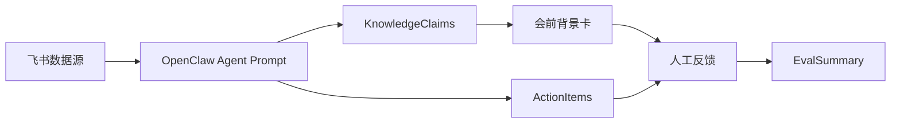

## 0、项目一览（决赛版本）

MeetingFlow 是一个围绕会议生命周期的 Evidence-grounded Agent。它把飞书生态里散落的文档、群聊、妙记和历史任务，先压缩成带证据的 Evidence Claims，再在合适的时机推送给团队。

### 0.1 分层架构

```text
┌──────────────────────────────────────────────────────────┐
│  Channel    飞书 Bot DM / 群消息 / Cron / Webhook(规划)   │
├──────────────────────────────────────────────────────────┤
│  Agent      OpenClaw Prompt（理解上下文、抽取候选 items） │
├──────────────────────────────────────────────────────────┤
│  Core       meetingflow-core 确定性脚本                   │
│             retrieve  → verify-evidence → stable-id       │
│             → score-run → lock / checkpoint               │
├──────────────────────────────────────────────────────────┤
│  Storage    Bitable 4 表（展示/审阅/评测）                │
│             Meetings · MeetingRuns · MeetingItems · Feedback │
├──────────────────────────────────────────────────────────┤
│  Eval       golden-set.json + run-eval.mjs                │
│             precision / recall / F1 / hit@k / dedupe       │
└──────────────────────────────────────────────────────────┘
```

边界原则：

- LLM 只产候选，不下最终结论。
- 证据校验、ID、评分、锁、checkpoint、检索打分全部下沉到 core。
- Bitable 不再承担运行时状态，只做展示、审阅、评测沉淀。

### 0.2 Failure Path（每一层怎么挡）

```text
LLM 幻觉一句不存在的证据
   └─► verify-evidence 在 Core 层拒绝（rejected, evidence_not_found）
       └─► 不写入 MeetingItems，只能进 needs_review

LLM 把同一条 action 抽出两次（文案略有差异）
   └─► stable-id 计算 action_fingerprint 归并
       └─► MeetingItems 不重复，occurrence_id 区分来源

LLM 召回的资料与会议无关
   └─► retrieve(BM25) 先打分，仅 top_k 进入 Prompt
       └─► 同时挡住"无关日志"等噪声进入 Context Pack

Cron 同时触发两次同一场会
   └─► lock-acquire 在文件系统加锁（带 TTL）
       └─► 第二次直接 acquired=false, reason=lock_exists

知识索引中途崩溃
   └─► checkpoint-set 每批落盘 cursor
       └─► 重启从 checkpoint-get 续跑，不重来

评分被 LLM 估分不稳
   └─► score-run 用确定性公式计算六维 + overall
       └─► 每次输入相同 → 输出相同（可复现）
```

### 0.3 检索骨架（retrieve）

`retrieve` 是决赛版本新增的最小 RAG 骨架。当前实现是 BM25（CJK bigram + 拉丁词），可在 1ms 级别给出可解释的 hit list；embedding 向量检索作为可插拔的下一步保留。

```bash
node skills/meetingflow-core/scripts/core.mjs retrieve \
  < skills/meetingflow-core/examples/retrieve.input.json
```

输入 `{ query, docs[], top_k }`，输出每条 hit 都带 `score`、`matched_terms`（term/tf/idf 拆解）和 `snippet`。这条命令的存在意义是让"召回"不再是 Prompt 里一句"自己挑相关的"，而是一个可被评测、可被替换的模块。

### 0.4 自动化评测（mini eval）

```bash
node skills/meetingflow-core/eval/run-eval.mjs
# 或 --json 输出机器可读报告
node skills/meetingflow-core/eval/run-eval.mjs --json
```

3 个 case，覆盖：

- 证据校验 precision / recall / F1（含一条无证据的负样本）
- 检索 hit@1 / hit@k / must_not_top 违规计数
- stable-id 对相同语义不同文案的 action item 是否能归并

当前结果：`precision=1 / recall=1 / f1=1，hit@1=1，dedupe pass`。golden set 故意保持小且可解释，目的是自证 pipeline 行为，不是声称泛化能力。

### 0.5 路演 Demo 主线

按这条主线讲，3 分钟能把 6 个技术点全带出来：

| 时间 | 动作 | 对应模块 |
| --- | --- | --- |
| T-5min | 群里收到会前简报（截图/录屏） | Cron · retrieve · render-message pre-brief |
| T+10min | 群里收到会后行动项 + 结果质检 | LLM 抽取 · verify-evidence · stable-id · score-run |
| T+12min | 在 MeetingItems 表点开一条，看到 evidence_sentence 直接对回原文 | 证据可追溯 |
| T+15min | 发 `/feedback wrong_evidence <run_id>`，看 Feedback 写入 | 反馈闭环 |
| T+18min | 在终端跑 run-eval.mjs，看 precision/recall/F1 实时输出 | 评测可复现 |
| T+20min | 翻一条 rejected 记录，讲"如果没有 verify-evidence，这条会被当成事实写进 Bitable" | Bad Case 演示 |

### 0.6 主动交代的取舍（FAQ）

| 问题 | 回答 |
| --- | --- |
| 为什么不接入真实 embedding 向量库？ | 决赛版本先把 RAG 做成可插拔的骨架。BM25 已能在 mini eval 上拿到 hit@1=1；向量化是"换一个 retriever 实现"的工作量，不影响主干。 |
| 为什么不做按钮卡片回调？ | 飞书 interactive card 在当前通道渲染不稳定（容易显示 JSON 原文）。决赛版本冻结按钮反馈，统一用 `/feedback` 文本命令保证可演示。 |
| 为什么不直接对接飞书 Tasks？ | V1 阶段任务池放在 Bitable，便于人工审阅、批改、追评测；接入 Tasks 是产品化阶段的事，不是技术验证阶段的事。 |
| 为什么不做实时转写？ | 飞书妙记已经做了。MeetingFlow 的差异化在挑战一（信息→高密度知识），不在转写本身。 |
| 为什么 golden set 只有 3 条？ | 它是 self-test 不是 benchmark。目的是自证 pipeline 行为可复现；规模化评测在 eval 路径里通过加 case 即可扩展。 |

### 0.7 仓库结构

```text
skills/meetingflow-core/
├── SKILL.md                 # OpenClaw skill 描述与调用约定
├── scripts/core.mjs         # 7 个确定性命令的入口
├── schemas/                 # 输入候选与结果的 JSON schema
├── examples/                # 各命令的样例输入
└── eval/
    ├── golden-set.json      # mini golden set（3 cases）
    └── run-eval.mjs         # precision/recall/F1/hit@k/dedupe runner
```

---

## 1、评价指标
### 完整性&价值40 分• 解决什么问题 / 痛点？
• AI 在其中起到什么关键作用？
• 流程是否完整闭环？能否落地使用？
• Demo 是否稳定、可正常演示？
• 带来什么实际价值 / 效率提升？
### 创新性20 分• AI 相关创新点（技术选型 / 实现思路 / 应用方式）
• 方案差异化亮点
• 是否可复用、可推广
### AI 技术实现20 分• AI 技术使用深度
• 技术架构 / 方案合理性
• 工程规范、稳定性、可扩展性
### 路演表现20 分• 表达流畅度，逻辑结构完整性
• 回答专业度与深度
• 团队分工与协作配合
• 时间控制、演示节奏


## 2、项目要求

课题一：办公场景驱动的智能知识助手
【课题背景】
在企业内部，真正有价值的信息往往散落在数十篇飞书文档（Docs）、漫长的飞书会议妙记（Minutes）以及海量的群聊、任务和邮件中。传统的知识管理通常是“被动”的——员工必须知道去哪里搜、搜什么关键词。
本课题以应用落地为主、效果优化为辅，要求参赛队伍利用 OpenClaw、CLI 和飞书生态，打破信息孤岛，构建一个不仅能“精准问答”，更能“主动分发与推送”的智能知识助手。参赛者需要解决以下核心挑战：
- 挑战一：重新定义“知识获取” (Define it)
  知识不等于原始数据。如何将万字长文或零碎的聊天记录，提炼成当前场景下最需要的“高密度知识”？
- 挑战二：构建场景化知识应用 (Build it)
  结合飞书的文档、会议、消息等 API，打破传统的“对话框问答”模式。发挥创造力，设计一个能在恰当时机、以恰当形态（如卡片、报告、CLI 终端提示）主动服务用户的知识产物。
- 挑战三：证明应用的效果与价值 (Prove it)
  大模型最怕“幻觉”和“废话”。你需要自己设计一套评测用例和指标，证明你的产物不仅内容准确，而且真的提升了团队的信息流转效率。
【探索方向】
- 方向 B：会议与项目的全链路伴侣（偏协作与对齐）
  - 场景描述：围绕“开会”这一高频场景，能在会前基于日历邀请人，自动检索并推送“会前背景知识/历史文档卡片”；或在会后，自动抓取会议纪要中的 Action Items，直接转化为飞书任务并附带相关的知识库链接分发给执行人。
【交付物要求】
- 场景定义文档：说明你选择的知识场景、目标用户、核心价值，以及为什么通用搜索/问答无法满足。
- 可运行的 Demo：基于 OpenClaw/CLI 实现的主动知识服务，至少包含一种主动触发方式（定时、事件驱动、阈值触发）。
- 效果验证报告：自证知识产物的准确性（人工评估或引用来源）、用户接受度（如卡片点击率、任务完成率），以及相比传统方式的效率提升。

## 3、复赛成果

二、项目结果展示
1、总项目结果展示：
1）Demo展示
本项目 Demo 展示的是一个围绕会议生命周期运行的 MeetingFlow Agent。它基于飞书妙搭 OpenClaw 和飞书 Bot 搭建，能够在会议前自动生成背景卡，在会议后抽取 Action Items，并将推荐、任务和评测结果写入飞书多维表格。
Demo 主流程如下：
飞书文档 / 群聊 / 会议纪要 / Bitable 历史任务
-> MeetingFlow 知识索引
-> KnowledgeClaims 结构化知识库
-> 会前 5 分钟级自动扫描日历会议
-> Meeting Lens 召回相关 Evidence Claims
-> 生成会前背景卡并发送到群聊
-> 会后扫描会议纪要/群聊内容
-> 抽取 Action Items
-> 写入 ActionItems 表
-> 人工标注后自动汇总 EvalSummary
Demo 中可直接展示的成果包括：

- 飞书妙搭 OpenClaw 智能体 Meeting Agent
- 3 个自动定时任务：
  - MeetingFlow 知识索引
  - MeetingFlow 会前扫描
  - MeetingFlow 会后扫描
- 5 张 Bitable 表共同组成 Trace Eval 数据闭环：
  - KnowledgeClaims：结构化知识库，存储带来源证据的 Evidence Claims，是会前资料召回和排序的核心数据源。核心字段包括 claim_id、claim_type、claim、source_type、source_title、来源链接、来源证据句、topic_key、related_people、status、open_loop、confidence、final_score 等。
  - MeetingRuns：工作流运行记录表，用于记录会前和会后扫描状态，避免同一场会议重复触发或重复发送。核心字段包括 meeting_id、event_id、workflow、status、lock_until、会议标题、chat_id、message_id、error、created_at、updated_at、actions_waiting_minutes 等。
  - PreMeetingCards：会前资料推荐表，用于记录背景卡推荐内容、推荐理由、来源证据和人工反馈，是计算会前资料有用率的依据。核心字段包括会议标题、推荐资料、来源链接、推荐理由、关联风险、是否有用、人工评分、备注、claim、source_type、why_matters、claim_type、bad_case_type、来源证据句、rank。
  - ActionItems：会后任务追踪表，用于记录从会议纪要或群聊中抽取出的任务，是计算 Action Item 准确率和人工修改率的依据。核心字段包括会议标题、任务内容、负责人、截止时间、来源证据句、来源链接、置信度、状态、人工是否正确、人工修正内容。
  - EvalSummary：评测汇总表，用于聚合会前推荐和会后任务的人工反馈，形成项目效果验证报告。核心字段包括统计日期、Action Item 总数、人工确认数、人工修改数、准确率、会前资料有用率、Bad Case 数量、备注。
- 群聊中自动发送的会前背景卡
- Bitable 中自动写入的推荐记录、任务记录和评测结果
2）核心部分代码展示
本项目主要基于飞书妙搭 OpenClaw 的 Agent 工作流实现，核心不是传统代码文件，而是由多组结构化 Prompt、Bitable 数据表和定时任务共同组成的 AI 工作流。
核心逻辑包括：
- KnowledgeClaims 知识索引
定时读取飞书文档、群聊消息、ActionItems、PreMeetingCards
抽取 Evidence Claims
过滤无证据句、无关噪声和重复信息
写入 KnowledgeClaims 表
Meeting Lens 召回
基于会议标题、描述、参会人和历史未闭环任务生成 Meeting Lens
从 KnowledgeClaims 中召回与会议相关的 Candidate Claims
Evidence Claim 排序
meeting_score =
0.30 * keyword_match_score
0.20 * people_match_score
0.20 * open_loop_score
0.15 * recency_score
0.10 * source_authority_score
0.05 * novelty_score
会前背景卡生成
从 Top 20 Candidate Claims 中选择 Top 5-8
每条推荐保留来源标题、来源链接、证据句和推荐理由
写入 PreMeetingCards
会后 Action Items 抽取
从会议纪要/群聊中抽取任务内容、负责人、截止时间、来源证据句
写入 ActionItems
支持人工确认和修正
评测汇总
统计会前资料有用率、Action Item 准确率、人工修改率和 Bad Case 数量
写入 EvalSummary
核心数据结构示例：
{
  "claim_type": "decision",
  "claim": "V1 阶段先使用 Bitable 作为任务池和评测表，不直接接入飞书 Tasks。",
  "source_type": "doc",
  "source_title": "MeetingFlow 项目设计稿",
  "evidence_sentence": "V1 阶段先使用 Bitable 作为任务池和评测表，不直接接入飞书 Tasks。",
  "related_people": ["张三", "赵六"],
  "topic_key": "bitable_eval",
  "status": "active",
  "open_loop": false,
  "confidence": 0.92,
  "final_score": 0.86
}
3）项目亮点介绍
本项目解决的是会议前后信息流转低效的问题。企业协作中，真正有价值的信息往往分散在飞书文档、群聊、会议纪要和任务表中。传统方式需要人主动搜索资料，而且用户必须知道“搜什么、去哪里搜”。MeetingFlow Agent 将这个过程变成了主动服务：系统在会议前自动整理背景，在会议后自动拆解任务。
完整闭环包括：
知识整理 -> 会前推荐 -> 会后任务 -> 人工确认 -> 效果评测
项目价值主要体现在：
- 会前减少人工翻找资料时间。
- 会前卡不是普通摘要，而是带来源证据的高密度 Context Pack。
- 会后任务自动进入 Bitable，便于追踪负责人、截止时间和状态。
- 通过 EvalSummary 可以量化推荐有用率、任务准确率和 Bad Case。
- 整套流程基于飞书原生工具完成，适合团队实际落地使用。
差异化亮点是：本项目不是“接入飞书 API 的问答 Bot”，也不是“会议摘要助手”，而是一个围绕会议生命周期运行的 Evidence-grounded Meeting Workflow。
4）AI 亮点介绍
第一，使用了 Evidence Claim Memory。系统不会直接把大量文档和群聊丢给大模型生成答案，而是先把原始信息压缩成结构化 Evidence Claims。每条 Claim 都必须包含来源、证据句、主题、关联人、状态、置信度和分数。这样可以减少幻觉，也便于后续评测。
第二，使用了 Meeting Lens Retrieval。会前扫描不是简单按会议标题搜索资料，而是先让 AI 根据会议标题、描述、参会人和历史未闭环任务生成 Meeting Lens，再从 KnowledgeClaims 中召回相关 Claim。这样推荐结果更贴合当前会议场景。
第三，使用了可解释排序。系统结合关键词相关度、参会人重合、未闭环程度、新近程度、来源权威性和信息新颖性计算 meeting_score，再由大模型在 Top Candidate Claims 中生成最终会前卡。这比纯 LLM 判断更稳定，也更容易解释推荐理由。
第四，使用了 Trace Eval 闭环。AI 生成的推荐和任务不会只停留在聊天消息里，而是全部写入 Bitable。用户可以标注是否有用、是否正确、是否需要修改，系统再汇总成 EvalSummary。这样 AI 输出可以被追踪、被评估、被持续优化。
人和 AI 的分工如下：
- AI 负责：
从飞书信息中抽取 Evidence Claims
生成 Meeting Lens
召回和排序会前资料
生成会前背景卡
抽取会后 Action Items
汇总评测指标
人负责：
标注推荐是否有用
确认任务是否正确
修正负责人、截止时间和任务内容
根据 EvalSummary 复盘 Bad Case
模型选型上，本项目优先使用飞书妙搭 OpenClaw 中可用的智能模型能力，并通过结构化 Prompt、Bitable 字段约束和证据句规则降低模型不稳定性。相比直接让模型自由生成，项目更强调：
先结构化，再生成；
先证据约束，再推荐；
先留痕，再评测。
引入 AI 后，原来的会议工作流从被动变成主动：
原来：人开会前自己翻文档、搜群聊、整理待办。
现在：Agent 自动维护会议知识库，会议前主动推送背景卡，会议后自动抽取任务，并形成评测闭环。
这使得 MeetingFlow Agent 不只是一个 Demo Bot，而是一个可复用到项目周会、需求评审、复盘会、客户会议等场景的会议知识流转 Agent。
三、其他信息-自由发挥区
为了确认项目方向，我调研了一些会议智能助手和开源会议 Agent 的实现思路。Zoom AI Companion、腾讯会议 AI 小助手、钉钉 AI 助理/闪记、飞书妙记这类成熟产品，核心能力大多集中在会议中或会后：实时转写、会议总结、关键讨论点、决策和待办提取。比如 Zoom AI Companion 支持会前准备、会中提问、会后总结和 Action Items；腾讯会议 AI 小助手也覆盖会前、会中、会后，并支持总结会议内容、提炼关键信息；飞书妙记则侧重语音转写、智能纪要、待办事项和关键词提取。
我也看了一些 GitHub 上的开源会议助手项目。比如 meetscribe 侧重本地转写、说话人识别、AI 摘要和 PDF 输出；h3xassist 通过 Playwright 自动加入 Google Meet / Teams，使用 WhisperX 转写、Gemini 总结，并提供实时 Dashboard；Meeting BaaS 提供面向 Zoom、Google Meet、Teams 的会议 Bot 转写 API；acai 则把会议、转写、Action Items、Notes 做成 MCP 工具，方便 AI Agent 查询和写回。
这些项目给我的启发是：会议 AI 的常规路径是：
音视频接入
-> 语音转写
-> 会议摘要
-> Action Items
-> 文档或任务系统写回
但我的项目没有把重点放在“再做一个会议转写/摘要工具”上，因为飞书生态里已经有妙记、文档、群聊、日历和 Bitable。我的差异化是把重点放在挑战一：如何把会议前后散落的信息变成当前会议真正需要的高密度知识。
因此，MeetingFlow Agent 的技术路线是：
飞书文档 / 群聊 / 妙记 / Bitable
-> KnowledgeClaims 结构化知识库
-> Meeting Lens 会议视角召回
-> Evidence Claim 排序
-> 会前 Context Pack
-> 会后 Action Items
-> Bitable Trace Eval
相比普通会议纪要工具，本项目更强调三个点：
1. 会前主动服务
不是等会议结束后总结，而是在会议开始前自动扫描日历，并基于会议主题、参会人、历史未闭环任务生成背景卡。
1. Evidence Claim Memory
不直接把海量文档和群聊塞给 LLM，而是先抽成带来源证据句、状态、主题、关联人和置信度的 KnowledgeClaims。这让推荐结果更可追溯，也更容易评测。
1. Trace Eval 闭环
所有会前推荐和会后任务都会写入 Bitable。用户可以人工标注是否有用、是否正确、是否需要修改，系统再汇总出会前资料有用率、Action Item 准确率和 Bad Case 数量。
我认为这个项目的价值不在于“Bot 能不能发一条消息”，而在于把会议协作中的信息流转变成一个可追踪、可评测、可持续优化的 Agent 工作流。即使当前 Demo 规模不大，它也验证了一条可推广的路径：用 AI 把企业协作信息从原始文本变成结构化知识，再在合适的会议时机主动分发给团队。

## 4、初赛版本：Prompt 驱动的会议知识流转闭环

初赛版本的目标是先证明方向成立：MeetingFlow 不是再做一个会议转写或普通会议摘要工具，而是围绕会议生命周期，把飞书生态里分散的文档、群聊、妙记和历史任务转化为可追踪的会议知识流。

### 4.1 初赛版本定位

- 参赛课题：办公场景驱动的智能知识助手 · 方向 B（会议与项目全链路伴侣）
- 一句话定位：会前主动生成高密度背景卡，会后抽取 Action Items，并把推荐、任务和人工反馈写入 Bitable，形成 Trace Eval 闭环。
- 核心验证点：在不自建转写系统的前提下，复用飞书文档、妙记、群聊、日历和 Bitable，把企业协作信息变成会议前后可用的知识。

初赛版本的主链路如下：

```text
飞书文档 / 群聊 / 妙记 / Bitable 历史任务
-> KnowledgeClaims 结构化知识库
-> Meeting Lens 会议视角召回
-> Evidence Claim 排序
-> 会前 Context Pack
-> 会后 Action Items
-> Bitable Trace Eval
```

### 4.2 初赛版本核心能力

| 能力 | 实现方式 | 价值 |
| --- | --- | --- |
| 知识索引 | 定时读取飞书文档、群聊、会议纪要和历史 Bitable 记录，抽取 Evidence Claims | 把原始长文本压缩成可召回、可追溯的高密度知识 |
| 会前扫描 | 每 5 分钟扫描未来会议，基于会议标题、参会人和历史任务生成 Meeting Lens | 从“人主动找资料”变成“Agent 主动推送背景” |
| 会后扫描 | 每 10 分钟扫描已结束会议，从妙记/纪要中抽取 Action Items | 把会议结论转化为可追踪任务 |
| Trace Eval | 将会前推荐、会后任务和人工反馈写入 Bitable | 让 AI 输出可以被检查、被标注、被复盘 |

### 4.3 初赛版本 Bitable 五表

初赛版本使用 5 张 Bitable 表承接完整闭环：

| 表 | 作用 |
| --- | --- |
| KnowledgeClaims | 结构化知识库，存储带来源证据的 Evidence Claims |
| MeetingRuns | 记录会前/会后工作流状态，同时承担防重复触发和运行锁 |
| PreMeetingCards | 记录会前推荐内容、来源证据、推荐理由和人工反馈 |
| ActionItems | 记录会后任务、负责人、截止时间、来源证据和人工修正 |
| EvalSummary | 聚合会前资料有用率、Action Item 准确率、Bad Case 数量 |

### 4.4 初赛版本 Prompt 工作流

初赛版本主要依赖 OpenClaw 智能体的 SOUL.md、TOOLS.md 和 3 个定时任务 Prompt。



会前扫描的关键步骤：

1. 查询未来 30 分钟会议。
2. 生成 meeting_id。
3. 通过 MeetingRuns 防重复触发。
4. 根据会议标题、描述、参会人生成 Meeting Lens。
5. 从 KnowledgeClaims、飞书文档、群聊和历史任务中召回候选内容。
6. 计算六维 meeting_score。
7. 选择 Top 5-8 条生成会前背景卡。
8. 写入 PreMeetingCards，并发送到飞书群聊。

初赛版本的可解释打分公式：

```text
meeting_score = 0.30 × 关键词相关度
              + 0.20 × 参会人重合
              + 0.20 × 未闭环程度
              + 0.15 × 新近程度
              + 0.10 × 来源权威性
              + 0.05 × 信息新颖性
```

### 4.5 初赛版本完成度与局限

初赛版本已经把“会议知识主动服务”这条产品路径跑通，但也暴露出几个决赛前必须修复的技术风险：

| 问题 | 影响 | 决赛改造方向 |
| --- | --- | --- |
| 六维打分主要靠 LLM 自行估分 | 不稳定、不可复现 | 改为代码化 scorer |
| evidence_sentence 只靠 Prompt 约束 | 存在幻觉证据风险 | 增加 evidence verifier |
| claim_id/action_id 由 LLM 生成 | 去重和更新逻辑不稳 | 改为 stable ID/hash |
| MeetingRuns 同时承担状态表和运行锁 | 并发重复触发风险 | 运行锁下沉到 core |
| Bitable 同时做展示层和运行时状态层 | 架构边界不清 | Bitable 只保留展示、审阅、评测 |
| 评测更多是表格汇总 | 缺少稳定可复现指标 | 增加 score-run 和 Feedback 闭环 |

因此，初赛版本可以理解为“产品路径验证版”：它证明了会前主动服务、会后任务抽取和 Trace Eval 闭环是成立的；决赛版本则重点把这些高风险环节工程化。

## 5、决赛版本：meetingflow-core 驱动的工程化架构

决赛版本没有推翻初赛产品方向，而是把初赛里最容易被质疑的部分从 Prompt 约束升级为代码约束。LLM 继续负责理解上下文、RAG 召回结果和抽取候选内容；确定性逻辑交给 `meetingflow-core` 执行。

### 5.1 决赛版本核心思路

```text
LLM / RAG：理解上下文、抽取候选 items
meetingflow-core：证据校验、稳定 ID、评分、运行锁、checkpoint
Bitable：展示、审阅、人工反馈、评测沉淀
Markdown 消息：会前简报、会后行动项、结果质检
```

这个调整的目的不是把所有技术树叶一次性补齐，而是先搭出可靠主干：

- 让正式写入 Bitable 的内容必须有证据。
- 让 ID、评分、锁和 checkpoint 可复现。
- 让会前、会后、知识索引都有清晰的运行记录。
- 让评委能看到从产品闭环到工程闭环的演进。

### 5.2 初赛版本与决赛版本对比

| 维度 | 初赛版本 | 决赛版本 |
| --- | --- | --- |
| 架构重心 | Prompt + Bitable 工作流 | Prompt + `meetingflow-core` + Bitable 展示层 |
| 数据表 | 5 表：KnowledgeClaims / PreMeetingCards / ActionItems / MeetingRuns / EvalSummary | 4 表：Meetings / MeetingRuns / MeetingItems / Feedback |
| 证据约束 | Prompt 要求 evidence_sentence | `verify-evidence` 代码校验来源文本 |
| ID 生成 | LLM 生成 claim_id/action_id | `stable-id` 生成稳定 ID/fingerprint |
| 评分 | LLM 按公式估分 | `score-run` 代码化六维评分 |
| 运行锁 | 写在 Bitable MeetingRuns | `lock-acquire` / `lock-release` |
| 知识索引恢复 | 无稳定 checkpoint | `checkpoint-get` / `checkpoint-set` |
| 展示方式 | 飞书卡片 / 表格记录 | Markdown 文本消息，避免 card JSON 渲染不稳定 |
| 反馈方式 | 表格人工标注 | `/feedback` 文本命令写入 Feedback |

### 5.3 决赛版本四表架构

决赛版本将 Bitable 从“运行时状态层”收敛为“展示层、审阅层、评测层”。

| 表 | table_id | 作用 |
| --- | --- | --- |
| Meetings | `tbld0T8egh38fpLL` | 存储会议基础档案，如 event_id、title、start_time、chat_id、source_status |
| MeetingRuns | `tblEL1dvmbRrSYTV` | 存储每次会前扫描、会后扫描、知识索引、评测运行结果 |
| MeetingItems | `tblDXbzz1OofsIGC` | 统一存储 claims、action items、decisions、risks、open issues、background、updates |
| Feedback | `tblkzLyHIFOihnWY` | 存储会前/会后反馈和人工评测标签 |

旧五表已从正式链路移除。正式写入只允许进入这 4 张表。

### 5.4 meetingflow-core Skill

`meetingflow-core` 是决赛版本的确定性工程层，路径为：

```bash
node skills/meetingflow-core/scripts/core.mjs <command>
```

核心命令：

| 命令 | 用途 |
| --- | --- |
| `verify-evidence` | 校验候选 item 的 evidence_sentence 是否真实出现在 source_text 或 sources[].text 中 |
| `stable-id` | 为 verified items 生成稳定 item_id、fingerprint、occurrence_id |
| `score-run` | 根据结构化指标计算六维评分和 overall_score_100 |
| `checkpoint-get` | 知识索引读取 cursor |
| `checkpoint-set` | 知识索引保存 cursor |
| `lock-acquire` | 处理单场会议前获取锁 |
| `lock-release` | 处理完成后释放锁 |

正式写入 MeetingItems 前的最小规则：

1. LLM 只抽取候选 items。
2. 候选必须尽量包含 type、claim/task、evidence_sentence、source_title、source_url、confidence。
3. 先执行 `verify-evidence`。
4. 再执行 `stable-id`。
5. 只有 verified=true 且 id_status=stable 的内容进入正式记录。
6. 未通过证据校验的内容只能进入 needs_review/rejected，不能当成正式结论。

### 5.5 决赛版本三条 Cron 主链路

#### 会前扫描

```text
查询未来 30 分钟会议
-> upsert Meetings
-> 创建 MeetingRuns(workflow=prep)
-> RAG/历史会议/文档召回
-> LLM 抽取 background / risk / open_issue / update 候选
-> verify-evidence
-> stable-id
-> 写入 MeetingItems
-> render-message.mjs pre-brief
-> 发送 Markdown 会前简报
-> 更新 MeetingRuns
```

#### 会后扫描

```text
查询最近结束会议
-> lock-acquire
-> upsert Meetings
-> 创建 MeetingRuns(workflow=post)
-> 获取妙记 / 会议文档 / 会议原文
-> RAG/历史会议/文档召回
-> LLM 抽取 action_item / decision / risk / open_issue / background 候选
-> verify-evidence
-> stable-id
-> score-run
-> 写入 MeetingItems
-> render-message.mjs post-actions
-> render-message.mjs post-feedback
-> 发送 Markdown 会后行动项与结果质检
-> 更新 MeetingRuns
-> lock-release
```

#### 知识索引

```text
checkpoint-get
-> 从 cursor 后继续读取
-> 每批只处理 1 条，单次最多 2 条
-> LLM 抽取 knowledge items 候选
-> verify-evidence
-> stable-id
-> 写入 MeetingItems / MeetingRuns
-> 每处理完 1 条立即 checkpoint-set
-> 最终只输出短摘要
```

### 5.6 Markdown 展示与反馈闭环

飞书 interactive card 在当前通道中无法稳定渲染，容易变成 JSON 原文。因此决赛版本冻结按钮反馈和 card JSON 展示，改用 Markdown 文本消息作为正式展示。

渲染脚本：

```bash
node skills/meetingflow-core/scripts/render-message.mjs pre-brief
node skills/meetingflow-core/scripts/render-message.mjs post-actions
node skills/meetingflow-core/scripts/render-message.mjs post-feedback
```

三类正式消息：

| 消息 | 触发链路 | 内容 |
| --- | --- | --- |
| 会前简报 | 会前扫描 | 会议重点、背景、风险、待确认、建议议程 |
| 会后行动项 | 会后扫描 | 任务、负责人、截止时间、证据 |
| 结果质检 | 会后扫描 | 证据通过率、写入条目、被拒绝数、系统评分 |

反馈入口统一使用文本命令：

```text
/feedback up <run_id>
/feedback down <run_id>
/feedback wrong_evidence <run_id>
/feedback missing_action <run_id>
/feedback missing_background <run_id>
/feedback wrong_risk <run_id>
```

Feedback 表使用文本字段：

- `card_type_text`：pre / post
- `feedback_type_text`：up / down / wrong_evidence / missing_action / wrong_assignee / wrong_due_date / missing_background / wrong_risk / not_relevant / need_more_context / other

### 5.7 已完成的最小验证

| 验证项 | 结果 |
| --- | --- |
| 会后扫描最小验证 | 已处理 `MeetingFlow 复赛 Demo 评审`，生成 `post-meetingflow-review-2026-05-06-001` |
| Evidence 校验 | 6 verified / 1 rejected |
| 稳定 ID | stable-id 全部通过 |
| 六维评分 | `overall_score_100=47.5` |
| MeetingItems 写入 | 6 条写入成功 |
| 知识索引最小验证 | checkpoint-get / checkpoint-set 通过 |
| 会前扫描最小验证 | 无未来会议时正确写入 skipped run |
| Markdown 展示 | pre-brief / post-actions / post-feedback 均可渲染并发送 DM |
| Feedback 写入 | `/feedback` 文本命令写入 Feedback 表成功 |

### 5.8 当前保留与下一步规划

决赛版本已经完成“主干工程化”，但没有声称所有能力都已完全产品化。当前保留和规划如下：

| 能力 | 当前状态 | 后续规划 |
| --- | --- | --- |
| RAG 召回 | 保留原有飞书文档、历史会议、Bitable 召回 | 后续接入 embedding 向量检索 |
| 知识去重 | stable-id 解决确定性 ID | 后续增加语义相似度去重 |
| 评测 | score-run + Feedback 表 | 后续建设 golden set 和离线 eval 脚本 |
| 触发方式 | Cron 定时扫描 | 后续接入飞书 webhook 事件驱动 |
| 卡片交互 | 暂时使用 `/feedback` 文本命令 | 按钮回调作为 experimental，不进入决赛正式链路 |

### 5.9 决赛答辩表述

这个项目的决赛思路不是“把所有会议助手能力都做完”，而是先把产品方向和技术主干立住：

1. 产品上，它不是普通会议摘要工具，而是会前主动知识分发 + 会后任务追踪 + 评测闭环。
2. 技术上，它没有让 LLM 直接决定最终事实，而是把证据校验、ID、评分、锁和 checkpoint 下沉到代码。
3. 工程上，它把 Bitable 从运行时状态层收敛为展示、审阅和评测层。
4. 演示上，它可以展示 Cron 自动触发、Markdown 消息输出、MeetingItems 写入、MeetingRuns 评分和 Feedback 回写。
5. 规划上，它保留了向量检索、事件驱动、离线评测和语义去重的扩展路径。
